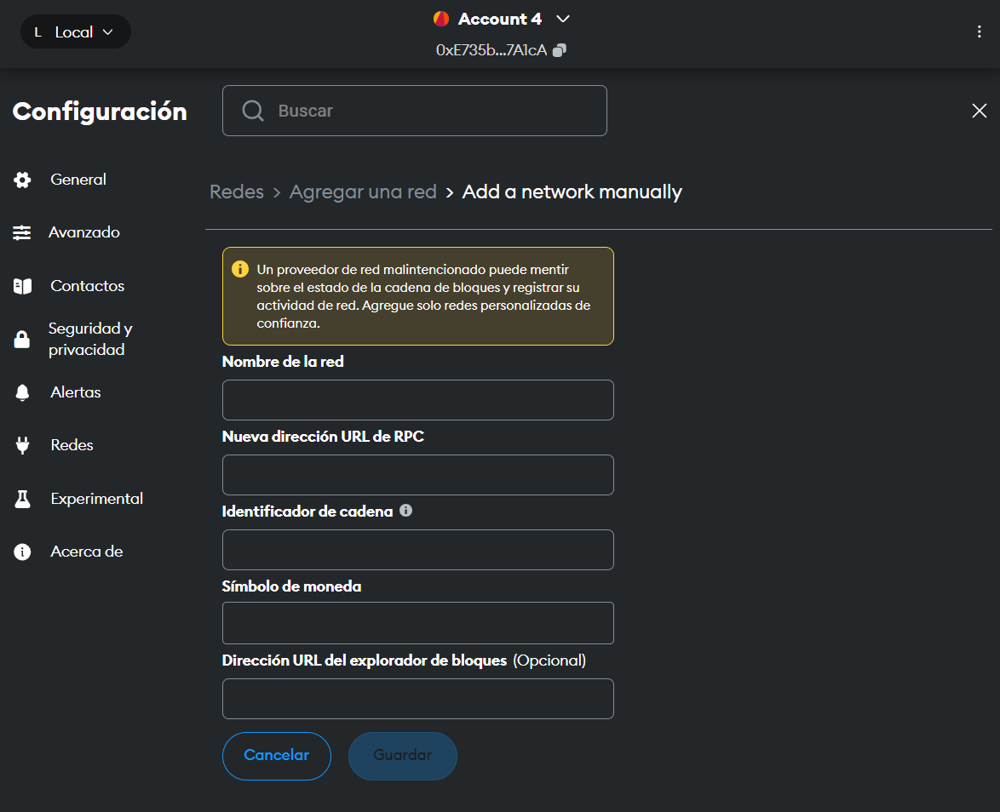

# DApp para la trazabilidad

Este es un sistema basado en blockchain para solucionar el problema de la trazabilidad de la harina de pescado.

La harina de pescado pasa un proceso de transoformación desde que es un lote de anchoveta hasta un ser un paquete de harina de pescado.


Claramente este es un proceso ficiticio y conveniente para revelar las virtudes de blockchain sobre una base de datos tradicional.

# Omnisciencia

Block chain posee muchas ventajas como su seguridad, transparencia, inmutabilidad, entre otras más; sin embargo la característica principal por la que blockchain es el sistema predilecto para este sistema es porque blockchain es un registro descentralizado, es decir, está en todos lados, proporcionando un fácil acceso para cualquier entidad con la autorización suficiente como para hacer seguimiento y control sobre los registros que se guardan en la blockchain.

# Como desplegar

1. Necesitarás un entorno de blockchain de ethereum. Una alternativa popular es utilizar [Ganache](https://archive.trufflesuite.com/ganache/). Instala ganache y elige la opción de **Quick start**.

2. Necesitarás hacer uso de una billetera virutal en tu navegador ya que se trata etherum, Instala [Metamask](https://chromewebstore.google.com/detail/metamask/nkbihfbeogaeaoehlefnkodbefgpgknn?hl=es) en tu navegador.

3. Configura Metamask:

   - Crea una cuenta en metamask
   - Configura la red blockchain a la cual metamask se va a conectar, por defecto la blockchain de ganache corre en el puerto 7545. Deberás rellenar los datos del formulario para crear la conexión a la red, cosas que debes tener en cuenta:
     - Nombre de la red: es el nombre que le darás a tu red, es arbitario así que elige cualquiera.
     - Nueva diracción URL: como te dije ganache corre en el puerto 7545 por lo tanto la URL sería **http://localhost:7534**.
     - Identificador de cadena: para este uso deberás poner **0x539**.
     - Símnolo de moneda: la divisa que deberás poner es ETH (ether).
     - Dirección URL del explorador de bloques: no es necesario que lo llenes.

   <br>

   <div style="display:grid;gap:10px; justify-content: space-evenly;grid-template-colums: 1fr 1fr 1fr;">
     
      
     
  
      
  
      
      
   </div>

   - Compila el smart contract: el archivo **FishmealTraceability.sol** es el smart contract, utiliza una herramienta para compilarlo, en mi caso utilicé el framework **Truffle** pero en otro entorno de nodejs. Los comandos que deberás ingresar son los siguietes:


Instalar Truffle
```shell
npm i truffle -g
```

Iniciar Truffle
```shell
truffle init
```

Compilar el contrato
```
truffle compile
```

Desplegar el contrato a la blockchain
```
truffle deploy
```

4. En la carpeta encontrarás el json del contrato que utilicé en su momento. Reemplaza este json por el que has generado en la compilación.

5. Iniciar el proyecto con **npm run dev**

6. Iniciar sesión en la ruta http://localhost:5173/login. Las credenciales son:
    - Administrador para el registro de lotes de anchovetas: admin 1234
    - Administrador para el registro de lotes de harina de pesdcado: admin2 1234
    - Administrador para el registro de paquetes de harina: admin3 1234

7. La vista inicial para registrar lotes de anchovetas hace consultas a un backend el cual en un futuro podría implementar IoT para obtener la información a registrar; sin embargo este backend actualmente es un simulador que envía información aleatoria. Este backend esta en este [repositorio](https://github.com/axl72/Arduino-Client). Inicialmente lo había desplegado en RailWay pero ya no está funcionando ahí, tendrás que clonar el repositorio e iniciarlo con **npm run dev**. Este servicio estará escuchando en el puerto 3000 por lo tanto tendrás que cambiar el código de este proyecto en el archivo **/views/AnchovyMenu.jsx**.

```Javascript
//  Esta línea debe ser reemplazada

const res = await fetch("https://arduino-client-production.up.railway.app/api/data");

// por esta línea

const res = await fetch("https://localhost:3000/api/data");
```
